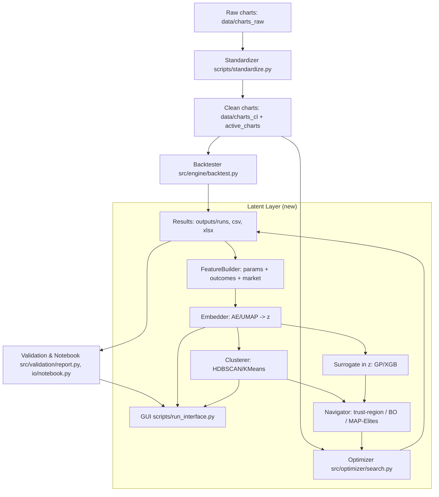
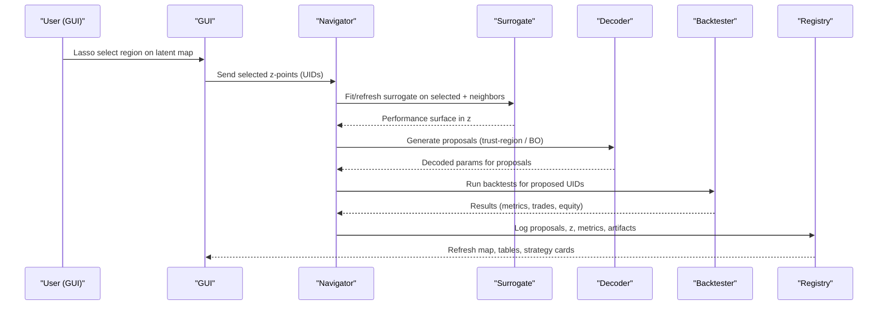

## Latent-Space Integration Plan for v4.2.4

### Scope
This document defines how to add a latent-space reasoning layer to the existing v4.2.4 pipeline without changing current behaviors. It introduces feature engineering, embedding, clustering, surrogate modeling, and proposal generation that dovetail with your standardize → optimize → encode/backtest/interface workflow and UID-driven traceability.

### Objectives
- Encode strategy parameters, outcomes, and market state into latent vectors z
- Discover high-performance regions and anomalies; monitor drift
- Propose safe, interpretable strategy variants via latent traversal/BO
- Feed insights back into the optimizer/backtester and the GUI
- Maintain strict UID provenance, model/data versioning, and approval gates

### System Map (with Latent Layer)

### New Data Products
- FeatureRow parquet per `trial_uid`: params features (scaled + toggles + constraints), outcome features (v4.3 metrics; equity-shape signatures), market features (vol, trend/reversion proxies, seasonality). Optional: sensitivity channels and sequence embeddings.
- LatentPoint parquet: `z`, reconstruction error, embedder/UMAP versions, cluster labels/probabilities.
- Cluster summaries: per-cluster medians/IQRs of metrics, stability (IS/OOS gaps), density and size.
- Surrogate artifacts: model pickle with CV scores and SHAP attributions.
- Proposal manifests: decoded params from centroid/trust-region/BO/MAP-Elites.
- Registry: `strategy_card.yaml` per UID; `graph.json` for lineage.

### Component Blueprint (new modules)
- `src/latent/feature_builder.py`: ingest `outputs/runs/*` and compute FeatureRow.
- `src/latent/embedder.py`: train/infer AE; persist model and produce LatentPoint.
- `src/latent/clusterer.py`: HDBSCAN + k-NN graph; cluster scorecards.
- `src/latent/surrogate.py`: GP/XGBoost predicting multi-objective scores from z.
- `src/latent/navigator.py`: proposal generation (trust-region sampling, BO in z, MAP-Elites) and decoding to params.
- `src/latent/registry.py`: UID registry and `strategy_card.yaml` management.

### Encoding Design
- Params: z-score continuous; one-hot toggles; add constraint flags; optional finite-diff local sensitivities on top metrics.
- Outcomes: include v4.3 metrics (CAGR, Calmar, Omega@0/@fees, UPI, UI, tail ratio, CVaR, equity R^2, turnover, time-in-market, fee-sensitivity deltas), and regime-conditional metrics if enabled.
- Market: realized vol/quarticity, ADX/momentum slopes, ACF(1), seasonality dummies; optional compact market embedding from AE over return windows.
- Dimensionality reduction: AE latent (d=8–16) as source of truth; UMAP only for visualization.

### Clustering, Surrogate, Navigation
- Clustering: HDBSCAN on AE z; keep soft probabilities and outlier scores; compute cluster medians/IQRs and stability gaps.
- Surrogate: GP or XGBoost in z predicting multi-objective; scalarize via Pareto rank or weighted score (e.g., Sharpe/UPI/Calmar with turnover/time-in-market penalties). Use uncertainty-aware acquisition for BO steps.
- Navigation: trust-region ellipsoids around cluster centroids; BO in z; decode proposals to params; optional latent arithmetic for targeted rule changes; MAP-Elites grid across z to maintain coverage.

### Integration with Pipeline
1) Optimizer completes → results/CSV/JSON updated under `outputs/*`.
2) FeatureBuilder runs → FeatureRow parquet appended.
3) Embedder trains/infers → LatentPoint appended; versions logged.
4) Clusterer labels and scores → assignments + summaries written.
5) Surrogate trains → pickled model; SHAP stored.
6) Navigator proposes → proposals JSON written.
7) Backtester consumes proposals → results flow back to outputs; loop repeats.
8) GUI reads LatentPoint/cluster assignments for interactive map and proposals.

### GUI Extensions
- Latent map panel (UMAP of AE z): color-by metric; size-by DD; regime shape.
- Lasso → send UIDs to Navigator → run proposals → overlay results.
- Cluster lens panel: stats, stability, coverage; filter map.
- Drift panel: market embedding z_m over time; distance to home cluster.

### Governance & Traceability
- Strategy cards per UID: uid, params, commit, data hash, model versions, z, cluster, metrics, IS/OOS gaps, approval state.
- Provenance graph: nodes (UIDs, clusters), edges (centroid decode, BO jump, interpolation, map-elite placement).
- Approval gates: cluster stability thresholds, min HDBSCAN prob, robustness score; drift compatibility checks.

### Risks & Mitigations
- AE overfit: denoising/sparse losses; multi-task heads; CV; monitor recon error.
- UMAP variability: AE latent is authoritative; UMAP for display only.
- Leakage: purged+embargoed folds; time-scoped features; forbid future info.
- Capacity realism: include cost/turnover/time-in-market in features and ranking.

### Implementation Steps (see separate 12-step explainer)
1) Approve data contracts → 2) FeatureBuilder → 3) AE Embedder → 4) UMAP viz → 5) Clusterer → 6) Surrogate → 7) Navigator → 8) Proposal runner → 9) GUI extensions → 10) Registry/cards → 11) Governance gates → 12) Cadence/monitoring.

### Interaction Sequence (GUI–Navigator–Backtester)

### Ownership & Gates
- FeatureBuilder (Research Eng): schema validated, backfilled.
- Embedder (ML Eng): model card, hashes, CV.
- Clusterer (ML Eng): params and stability report.
- Surrogate (Research Eng): CV and SHAP sanity.
- Navigator (Research Eng): trust-region/BO settings validated, decode checks.
- GUI (App Eng): panels integrated; reproducible from hashes.
- Registry (PM/Lead): 4-eyes approvals recorded on `strategy_card.yaml`.

### Acceptance
- New columns present (from 4.3) and used in FeatureRow.
- Latent artifacts reproducible from hashes.
- GUI shows latent map; proposals generate and round-trip through backtester.

